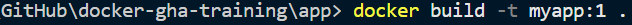
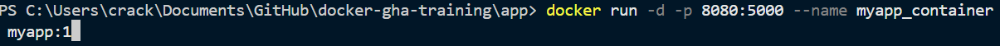
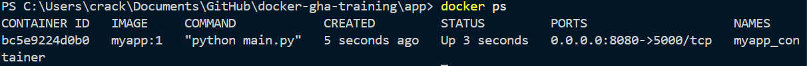
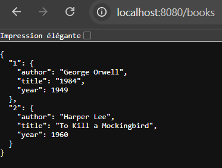
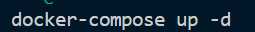
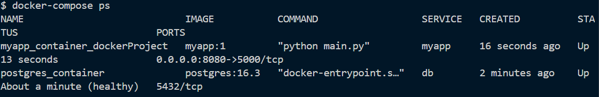
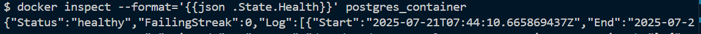
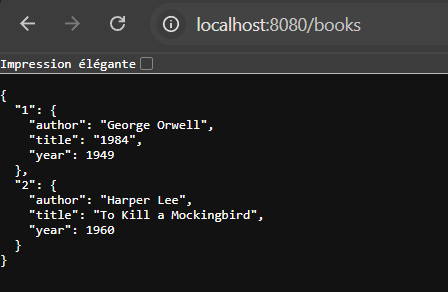
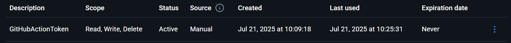
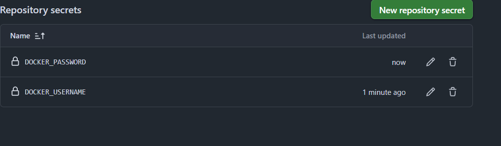

# Project Step

### 1. Docker Image Creation
- Created the Dockerfile in the `app` folder and moved `requirements.txt` into the same folder.
- Added `app.run(host='0.0.0.0', port=5000, debug=True)` in `main.py` to expose the Flask app outside the container.
- Built my Docker image:

    

- Ran the previously built image:

    

- To confirm, I checked the container status:

    

- Verified accessibility on port 8080:

    

### 2. Docker Compose Configuration

- Defined two services: `myapp` (the Flask application) and `db` (the PostgreSQL database).
- Configured a named volume to ensure database data persistence.
- Implemented health checks and `depends_on` conditions to guarantee that the database is fully initialized before the application starts.
- Managed the database password securely using Docker secrets.

#### Running Docker Compose:

- Started the Docker Compose services:

    

- Checked the status of the services to ensure they are running correctly:

    

- Verified that the PostgreSQL health check is passing:

    

- Confirmed that the application is accessible on port 8080:

    

### 3. GitHub Actions CI/CD Workflows

- Implemented two GitHub Actions workflows:

  - **Build and Push Docker Image**  
    - Triggered on pushes to the `master` branch.
    - Uses Docker Buildx to build the image and pushes it to Docker Hub.
    - Authentication is handled via a Docker Hub Personal Access Token.

  - **Build and Test Project**  
    - Runs on all pushes and pull requests.
    - Sets up Python, installs dependencies, and runs automated tests using `pytest`.

#### Setting Up Secrets and Authentication:

- Created a **Docker Hub Personal Access Token** for secure authentication:

    

- Added the Docker Hub credentials as **GitHub Repository Secrets** to be used in the workflows:

    

---

